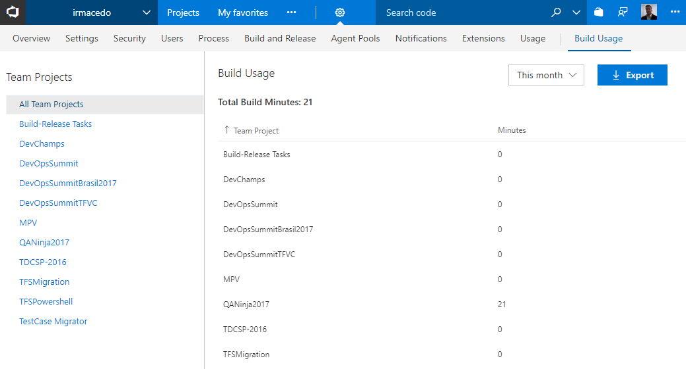
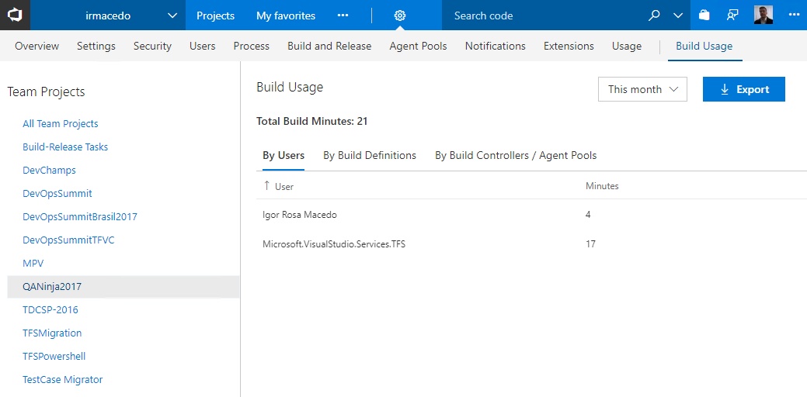
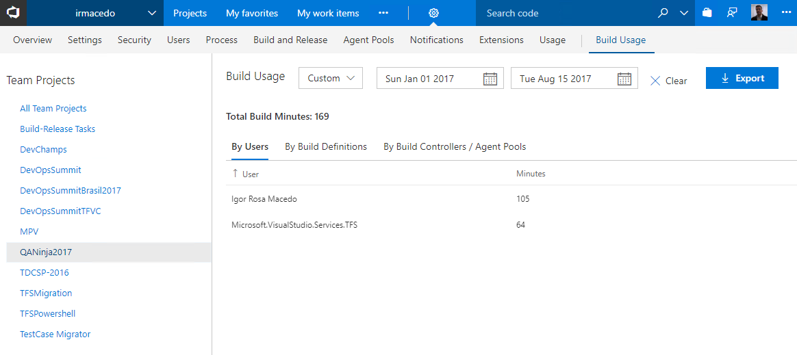
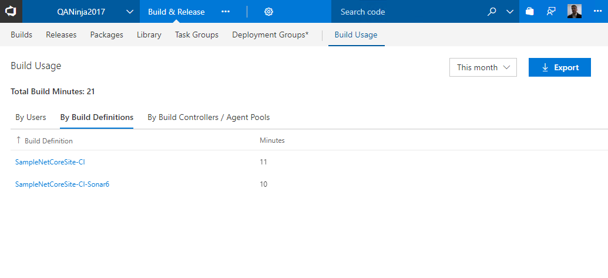

## Show build usage ##

Show how many build minutes are being used within an account.  Make them visible for your team by adding Build Usage tiles to your dashboard!

### Build Usage Widget ###

Add a Build Usage **Widget** to your dashboard!

### Build Usage Hub Group (Collection Level) ###

See and export to **CSV** the build usage for all your team projects!

See the build minutes for a specific Team Project grouped by **users**. 

What are the **Build Definitions** that more use build resources? Yes, you can filter by this month, last month, this year or a custom date range.

### Build Usage Hub (Team Project Level) ###

You can see the build usage hub also on the project level. 

## Learn more

> Microsoft DevLabs is an outlet for experiments from Microsoft, experiments that represent some of the latest ideas around developer tools. Solutions in this category are designed for broad usage, and you are encouraged to use and provide feedback on them; however, these extensions are not supported nor are any commitments made as to their longevity.

[View Notices](https://marketplace.visualstudio.com/_apis/public/gallery/publisher/ms-devlabs/extension/BuildandTestUsage/latest/assetbyname/ThirdPartyNotices.txt) for third party software included in this extension.

##Contributors##

We thank the following contributor(s) for this extension: [André Dias](http://blog.andredias.net) and [Igor Macedo](http://igormacedo.com.br). 

##Feedback ##

We need your feedback! Here are some ways to connect with us:

- Add a comment in the Q&A section below and please add an actionable review.
- Send us an [email](mailto://mktdevlabs@microsoft.com).

Review the [list of features and resolved issues of latest tools and extensions](https://aka.ms/vsarreleases) for information on the latest releases.